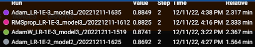
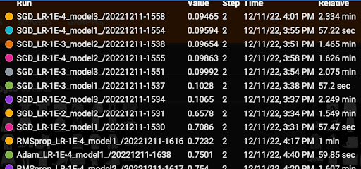
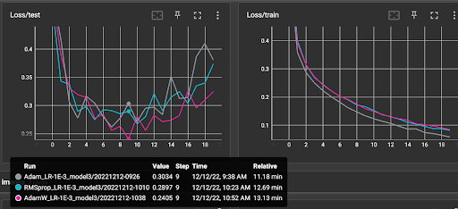
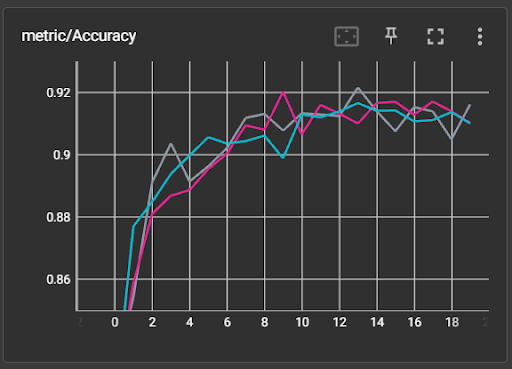
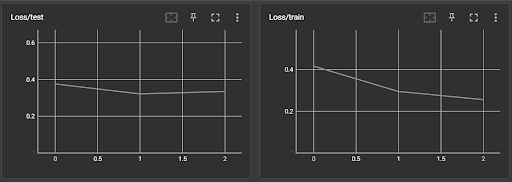
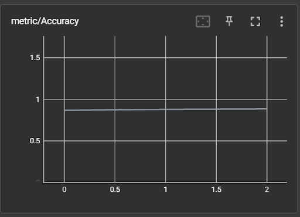

# Experimenten deeplearning convolutional layers op Fashion MNIST


Geef in settings.py aan welke combinaties je wilt uitproberen. De modellen bouw je op in het bestand settings_testmodels.py
```
    experiment_parameters_combinations: Dict = {
        'trainloop.optimizer' : {
            'AdamW' : optim.AdamW,
            'SGD' : optim.SGD,
            'RMSprop' : optim.RMSprop,
            'Adam' : optim.Adam
        },
        'trainloop.learning_rate' : {
            'LR-1E-2' : 0.01,
            'LR-1E-3' : 0.001,
            'LR-1E-4' : 0.0001,
        },
        'models' : {
            'model1' : 'model1',
            'model2' : 'model2',
            'model3' : 'model3',
        }
    }
```

De drie verschillende modellen bestaan uit:

**model 1**

- 3 convolution lagen
- 16 filters / activation maps
- 2 dense lagen

**model 2**

- 3 convolution lagen
- 32 filters / activation maps
- 3 dense lagen

**model 3**

- 3 convolution lagen
- 128 filters / activation maps
- 5 dense lagen


Run hierna autmatisch alle combinaties. Resultaten worden in de log map geplaatst.

`
$poetry run python main.py --task=combine --name=mijn_eigen_experiment_naam
`

De best scorende resultaten kan je verder testen door in de settings op te geven welke je wilt runnen.

```
    experiments_runs: Dict = {
        'run1' : {
            'epochs' : 20,
            'run_name' : 'Adam_LR-1E-3_model3',
            'optimizer' : optim.Adam,
            'learning_rate' : 0.001,
            'model' : 'model3',
        },
        'run2' : {
            'epochs' : 20,
            'run_name' : 'RMSprop_LR-1E-3_model3',
            'optimizer' : optim.RMSprop,
            'learning_rate' : 0.001,
            'model' : 'model3',
        },
        'run3' : {
            'epochs' : 20,
            'run_name' : 'AdamW_LR-1E-3_model3',
            'optimizer' : optim.AdamW,
            'learning_rate' : 0.001,
            'model' : 'model3',
        }
    }
```
Start de runs met onderstaand commando:

`
$poetry run python main.py --task=runs --name=mijn_eigen_experiment_naam
`

# Resultaten

Hieronder de best scorende resultaten van alle combinaties. 

Adam 1e-3 model 3
RMSprop 1e-3 model 3
AdamW 1e-3 model 3




Over het algemeen scoren de runs met optimizer SGD niet goed. Opmerkelijk is dat het er op lijkt dat optimizer SGD beter werkt met een hoge learning rate en een simpel model.




Je ziet hieronder dat na epoch 9 het model gaat overfitten. AdamW geeft hier de hoogste loss in de test set.





# ResNet testen en resultaten

**model ResNet18**

- 1 convolution laag
- 8 Res blokken met 2 convolution 
- 512 filters

Zie de code voor dit model in /src/models/resnet_model.py

Wat opgevallen is, is dat het trainen per epoch's 15 minuten duurt door het complexere model. Qua resultaat zie je dat na de eerste epoch het al een hooge accuracy heeft en deze bijna niet meer toe neemt.






```
==========================================================================================
Layer (type:depth-idx)                   Output Shape              Param #
==========================================================================================
ResNet                                   [64, 10]                  --
├─Sequential: 1-1                        [64, 32, 7, 7]            --
│    └─Conv2d: 2-1                       [64, 32, 14, 14]          1,600
│    └─MaxPool2d: 2-2                    [64, 32, 7, 7]            --
│    └─BatchNorm2d: 2-3                  [64, 32, 7, 7]            64
│    └─ReLU: 2-4                         [64, 32, 7, 7]            --
├─Sequential: 1-2                        [64, 32, 7, 7]            --
│    └─ResBlock: 2-5                     [64, 32, 7, 7]            --
│    │    └─Sequential: 3-1              [64, 32, 7, 7]            --
│    │    └─Conv2d: 3-2                  [64, 32, 7, 7]            9,248
│    │    └─BatchNorm2d: 3-3             [64, 32, 7, 7]            64
│    │    └─Conv2d: 3-4                  [64, 32, 7, 7]            9,248
│    │    └─BatchNorm2d: 3-5             [64, 32, 7, 7]            64
│    └─ResBlock: 2-6                     [64, 32, 7, 7]            --
│    │    └─Sequential: 3-6              [64, 32, 7, 7]            --
│    │    └─Conv2d: 3-7                  [64, 32, 7, 7]            9,248
│    │    └─BatchNorm2d: 3-8             [64, 32, 7, 7]            64
│    │    └─Conv2d: 3-9                  [64, 32, 7, 7]            9,248
│    │    └─BatchNorm2d: 3-10            [64, 32, 7, 7]            64
├─Sequential: 1-3                        [64, 128, 4, 4]           --
│    └─ResBlock: 2-7                     [64, 128, 4, 4]           --
│    │    └─Sequential: 3-11             [64, 128, 4, 4]           4,480
│    │    └─Conv2d: 3-12                 [64, 128, 4, 4]           36,992
│    │    └─BatchNorm2d: 3-13            [64, 128, 4, 4]           256
│    │    └─Conv2d: 3-14                 [64, 128, 4, 4]           147,584
│    │    └─BatchNorm2d: 3-15            [64, 128, 4, 4]           256
│    └─ResBlock: 2-8                     [64, 128, 4, 4]           --
│    │    └─Sequential: 3-16             [64, 128, 4, 4]           --
│    │    └─Conv2d: 3-17                 [64, 128, 4, 4]           147,584
│    │    └─BatchNorm2d: 3-18            [64, 128, 4, 4]           256
│    │    └─Conv2d: 3-19                 [64, 128, 4, 4]           147,584
│    │    └─BatchNorm2d: 3-20            [64, 128, 4, 4]           256
├─Sequential: 1-4                        [64, 256, 2, 2]           --
│    └─ResBlock: 2-9                     [64, 256, 2, 2]           --
│    │    └─Sequential: 3-21             [64, 256, 2, 2]           33,536
│    │    └─Conv2d: 3-22                 [64, 256, 2, 2]           295,168
│    │    └─BatchNorm2d: 3-23            [64, 256, 2, 2]           512
│    │    └─Conv2d: 3-24                 [64, 256, 2, 2]           590,080
│    │    └─BatchNorm2d: 3-25            [64, 256, 2, 2]           512
│    └─ResBlock: 2-10                    [64, 256, 2, 2]           --
│    │    └─Sequential: 3-26             [64, 256, 2, 2]           --
│    │    └─Conv2d: 3-27                 [64, 256, 2, 2]           590,080
│    │    └─BatchNorm2d: 3-28            [64, 256, 2, 2]           512
│    │    └─Conv2d: 3-29                 [64, 256, 2, 2]           590,080
│    │    └─BatchNorm2d: 3-30            [64, 256, 2, 2]           512
├─Sequential: 1-5                        [64, 512, 1, 1]           --
│    └─ResBlock: 2-11                    [64, 512, 1, 1]           --
│    │    └─Sequential: 3-31             [64, 512, 1, 1]           132,608
│    │    └─Conv2d: 3-32                 [64, 512, 1, 1]           1,180,160
│    │    └─BatchNorm2d: 3-33            [64, 512, 1, 1]           1,024
│    │    └─Conv2d: 3-34                 [64, 512, 1, 1]           2,359,808
│    │    └─BatchNorm2d: 3-35            [64, 512, 1, 1]           1,024
│    └─ResBlock: 2-12                    [64, 512, 1, 1]           --
│    │    └─Sequential: 3-36             [64, 512, 1, 1]           --
│    │    └─Conv2d: 3-37                 [64, 512, 1, 1]           2,359,808
│    │    └─BatchNorm2d: 3-38            [64, 512, 1, 1]           1,024
│    │    └─Conv2d: 3-39                 [64, 512, 1, 1]           2,359,808
│    │    └─BatchNorm2d: 3-40            [64, 512, 1, 1]           1,024
├─AdaptiveAvgPool2d: 1-6                 [64, 512, 1, 1]           --
├─Linear: 1-7                            [64, 10]                  5,130
==========================================================================================
Total params: 11,026,570
Trainable params: 11,026,570
Non-trainable params: 0
Total mult-adds (G): 1.71
==========================================================================================
Input size (MB): 0.20
Forward/backward pass size (MB): 28.79
Params size (MB): 44.11
Estimated Total Size (MB): 73.10
==========================================================================================
```